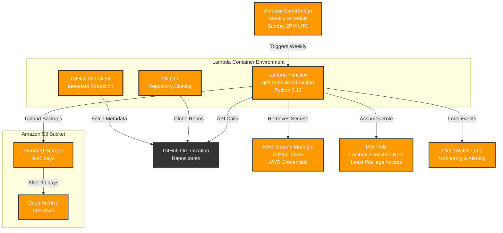

# GitHub Backup System - Architecture Documentation

## Overview

This system provides automated backup of GitHub organization repositories to AWS S3 using a containerized Lambda function. The solution runs on a weekly schedule and backs up repository code, metadata, and wikis.


## Architecture Components

### Core Services
- **AWS Lambda**: Containerized function that orchestrates the backup process
- **Amazon S3**: Storage for backup artifacts with lifecycle management
- **AWS Secrets Manager**: Secure storage for GitHub tokens and AWS credentials
- **Amazon EventBridge**: Scheduled trigger for weekly backups
- **AWS IAM**: Role-based access control for Lambda execution

### Container Infrastructure
- **Docker Container**: Custom Lambda container with Git and Python dependencies
- **Amazon ECR**: Container registry for storing the Lambda image

## System Flow

1. **Scheduled Trigger**: EventBridge rule triggers Lambda every Sunday at 2 PM UTC
2. **Credential Retrieval**: Lambda fetches GitHub token and AWS credentials from Secrets Manager
3. **Repository Discovery**: GitHub API call retrieves all organization repositories
4. **Backup Process**: For each repository:
   - Git repository cloned as mirror to `/tmp/backup`
   - Metadata fetched via GitHub API (issues, PRs, releases, etc.)
   - Wiki cloned if available
   - All artifacts compressed and uploaded to S3
5. **Storage Management**: S3 lifecycle policy moves backups to Deep Archive after 90 days

## Security Architecture

### Access Control
- Lambda execution role with minimal required permissions
- Secrets Manager for credential storage (no hardcoded secrets)
- S3 bucket with public access blocked
- IAM policies following principle of least privilege

### Network Security
- Lambda operates in AWS managed VPC
- HTTPS-only communication with GitHub API
- Server-side encryption for S3 storage (AES-256)

## Data Architecture

### Backup Structure
```
S3 Bucket: {bucket-name}/
├── {repo-name}/
│   ├── git_backup_YYYY-MM-DD.tar.gz     # Full git mirror
│   ├── wiki_backup_YYYY-MM-DD.tar.gz    # Wiki content
│   └── metadata/
│       ├── {repo-name}_issues.json       # Issues data
│       ├── {repo-name}_releases.json     # Release data
│       └── ... (other metadata files)
```

### Storage Classes
- **Standard**: New backups (0-90 days)
- **Deep Archive**: Long-term retention (90+ days)

## Scalability Considerations

### Performance Limits
- **Lambda Timeout**: 15 minutes maximum execution
- **Memory**: 2048 MB allocated
- **Ephemeral Storage**: 10 GB for temporary files
- **API Rate Limits**: GitHub API rate limiting handled

### Scaling Factors
- Number of repositories in organization
- Repository sizes and history depth
- Metadata volume (issues, PRs, etc.)

## Monitoring and Logging

### CloudWatch Integration
- Lambda execution logs automatically captured
- Structured logging with INFO/ERROR levels
- Backup success/failure tracking
- Performance metrics available

### Key Metrics to Monitor
- Lambda execution duration
- Memory utilization
- S3 upload success rates
- API call failures

## Disaster Recovery

### Backup Verification
- Multiple backup versions maintained
- Incremental updates for existing repositories
- Metadata stored separately from code

### Recovery Process
1. Access S3 bucket with backup data
2. Download and extract git mirrors
3. Restore to new GitHub repositories
4. Import metadata using GitHub API

## Cost Optimization

### Storage Costs
- Lifecycle policy reduces long-term storage costs
- Deep Archive for infrequently accessed backups
- Compression reduces storage requirements

### Compute Costs
- Weekly execution minimizes Lambda costs
- Container reuse reduces cold start overhead
- Efficient resource allocation (15min timeout, 2GB memory)

## Maintenance Requirements

### Regular Tasks
- Monitor backup success/failure
- Review S3 storage costs and usage
- Update GitHub token before expiration
- Test restore procedures periodically

### Updates and Patches
- Lambda runtime updates handled by AWS
- Custom container updates for dependencies
- Terraform state management for infrastructure changes

## Architecture Diagram

